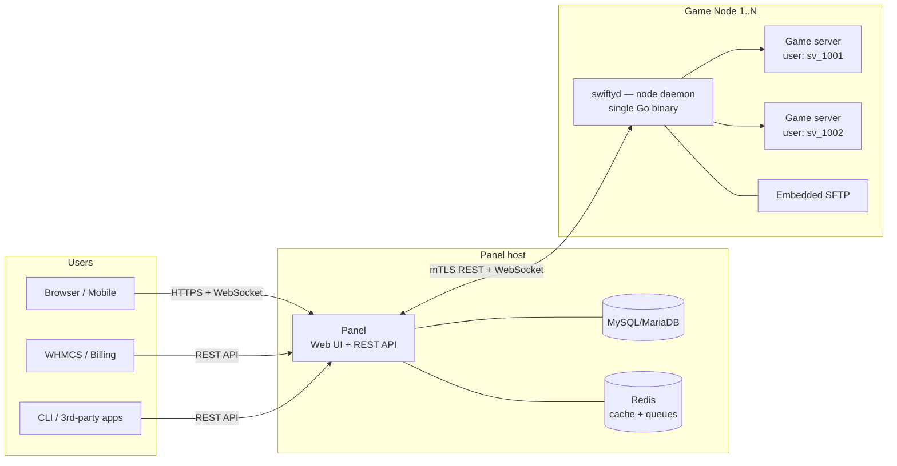

# Swifty — Architecture Overview

A modern, open-source game server hosting panel in the spirit of SwiftPanel:
**no Docker**, native Linux process isolation, an open core with paid modules.

---

## 1. Goals & constraints

| Goal | Consequence for the architecture |
|---|---|
| No Docker / containers | Isolation must come from native OS primitives: dedicated Unix users, cgroups v2, namespaces, quotas |
| Open-source core + paid modules | A first-class plugin/module system with stable extension points, and a license boundary between core and modules |
| Feature-rich, community-driven | Declarative game templates so the community can add games without touching core code |
| Hosting-provider friendly (the SwiftPanel audience) | Multi-node from day one, reseller-ready permission model, billing integration (WHMCS etc.) as a module |
| Easy to self-host | Few moving parts: single-binary daemon, simple panel deployment, one database |

---

## 2. High-level topology

The classic and correct shape for this product is **Panel + Node Daemon**
(what TCAdmin called Master/Remote and Pterodactyl calls Panel/Wings).
The panel never touches game processes directly — it talks to a daemon
installed on each machine that runs game servers.



**Why this split matters:**

- The panel host holds no game files and runs no game processes — it can be
  a cheap VPS. Nodes are the beefy machines.
- Nodes keep working if the panel is down: the daemon supervises processes
  autonomously (crash-restart, schedules) and re-syncs state when the panel
  returns.
- Adding capacity = install one binary on a new machine and paste a
  registration token.

---

## 3. The node daemon (`swiftyd`)

The heart of the system, and the hardest part to get right without Docker.
**Recommendation: write it in Go** — single static binary, trivial installs
(`curl | install`), excellent process/network handling, cross-compiles for a
future Windows agent.

### 3.1 Process isolation without Docker

Each game server gets:

1. **A dedicated Unix user** (`sv_<id>`), home directory =
   `/opt/swifty/servers/<uuid>`. This is the primary security boundary —
   game server A literally cannot read game server B's files.
2. **A cgroup v2 scope** per server for CPU weight/quota, memory limit
   (`memory.max` + `memory.high`), IO weight, and pids limit. Managed either
   directly via `/sys/fs/cgroup` or by launching through
   `systemd-run --scope` / transient units — recommend **transient systemd
   units**, since systemd then also gives you `NoNewPrivileges=`,
   `ProtectSystem=strict`, `ReadWritePaths=`, `PrivateTmp=`, restart
   policies, and OOM handling for free.
3. **Disk quotas** — XFS project quotas (best: per-directory) or ext4 user
   quotas as fallback.
4. **rlimits** (open files, core dumps) and an optional hardened mode using
   Linux namespaces (mount + PID via `unshare`/`bubblewrap`) for untrusted
   customers — off by default so plain dedicated-server binaries "just work".

This is exactly the pre-Docker hosting model, done with today's kernel
features. It is *lighter* than Docker (no image layers, no overlayfs, native
filesystem performance — relevant for map/FastDL-heavy games) at the cost of
weaker default isolation, which the tiered hardening above addresses.

### 3.2 Daemon responsibilities

- **Lifecycle**: install / start / stop / restart / kill / reinstall;
  crash detection with exponential-backoff auto-restart.
- **Console**: attach to the process via PTY, ring-buffer recent output,
  stream over WebSocket to the panel, accept command input.
- **Installers**: run game template install scripts (SteamCMD, direct
  downloads) as the server's user, with progress streaming.
- **File management**: read/write/archive/unarchive/chmod on behalf of the
  panel, always as the server's Unix user (never root at the syscall level —
  drop privileges per operation).
- **Embedded SFTP server**: credentials validated against the panel's API
  (`user.uuid` login form), jailed to the server directory. Kills the
  "shared system FTP" pain of the SwiftPanel era.
- **Stats & query**: per-process CPU/RAM/disk/network from cgroup
  accounting, plus game-protocol queries (Source A2S, Minecraft ping,
  SA-MP/openmp query, FiveM) for player counts and map info.
- **Schedules & backups**: cron-like tasks (restart, command, backup);
  backup targets local disk or S3-compatible storage, streamed as tar/zstd.
- **Port & IP allocation**: enforce the panel-assigned IP:port set;
  optional firewall integration (nftables) to block everything else.

### 3.3 Panel ⇄ daemon protocol

- Daemon exposes a **REST API + WebSocket**, authenticated by per-node
  tokens; use **mTLS or panel-issued short-lived JWTs** for defense in
  depth. The panel is the only client.
- The panel is the **source of truth**; the daemon holds a small local
  state file (SQLite or JSON) so it can supervise through panel outages and
  reconcile on reconnect.
- Browser console/file streams connect to the daemon **directly** (signed,
  short-lived JWT minted by the panel) so gigabytes of file transfers and
  console spam never proxy through the panel host.

---

## 4. The panel

### 4.1 Stack recommendation

Two viable paths — pick based on who you want contributing:

| | **A. PHP / Laravel + Vue or React** (recommended) | B. Go API + React SPA |
|---|---|---|
| Community | The game-hosting world (WHMCS, Pterodactyl ecosystem, Balkan hosting scene) lives in PHP — biggest contributor & module-author pool | Smaller pool for this niche |
| Deployment | Familiar to every host (nginx + php-fpm + MySQL) | Single binary — simplest possible |
| Plugin story | Mature: Composer packages, Laravel service providers, event hooks | You'd build plugin loading yourself (Go plugins are painful) |
| Velocity | Batteries included: auth, queues, notifications, Eloquent | More plumbing to write |

Given the goal of a module marketplace and community reputation,
**Laravel 11+ with a Vue 3/Inertia (or React) frontend, MySQL/MariaDB, and
Redis** is the pragmatic choice. The daemon stays Go regardless.

### 4.2 Core panel domains

- **Identity & access**: users, 2FA, API keys; roles at panel level
  (admin, sub-admin) and **per-server permission grants** (start/stop,
  console, files, subusers) — this granularity is what resellers and
  clan-mates need.
- **Fleet**: locations → nodes → IP/port allocations; node health,
  capacity, and (paid module) auto-deploy placement.
- **Servers**: the central aggregate — owner, node, allocations, resource
  limits, game template + variable values, install state.
- **Game templates** (see §5).
- **Scheduling, backups, audit log** (every action, by whom, from where —
  hosting providers need this for support disputes).
- **Public REST API** (versioned, `/api/v1`) — the same API the UI uses.
  This is non-negotiable: it's what makes WHMCS modules, Discord bots, and
  the ecosystem possible.

---

## 5. Game templates ("games as data")

Games must be **declarative configs, not code**, so the community can add
titles via PRs and a template marketplace can exist. A template (YAML)
defines:

```yaml
id: counter-strike-16
name: Counter-Strike 1.6
supports: [linux]
install:
  script: |            # runs as the server user, network-restricted
    steamcmd +force_install_dir /server +login anonymous \
      +app_set_config 90 mod cstrike +app_update 90 validate +quit
start:
  command: "./hlds_run -game cstrike +ip {{server.ip}} +port {{server.port}} +map de_dust2 +maxplayers {{env.MAX_PLAYERS}}"
  stop: "quit"          # console command; SIGTERM/SIGKILL as fallback chain
  ready_regex: "VAC secure mode is activated"
variables:
  - name: MAX_PLAYERS
    default: 32
    rules: "integer|between:2,32"
    user_editable: true
config_files:
  - path: cstrike/server.cfg
    parser: keyvalue     # panel edits hostname/rcon from the UI
query:
  protocol: a2s
```

The daemon executes install/start generically; the panel renders the
variables as forms. New game = new YAML file. Ship first-party templates
for the Balkan-classic lineup (CS 1.6, CS:S, CS2, SA-MP / open.mp, MTA,
Minecraft, FiveM, Rust, TeamSpeak) and let the community carry the tail.

---

## 6. Module system & the open-core business model

This is the strategic core of the project, so it must be designed in from
day one — bolted-on plugin systems always leak.

### 6.1 Technical extension points

- **Backend**: modules are Composer packages implementing a
  `SwiftyModule` contract — service provider + manifest (name, version,
  license requirements, permissions). They can register routes, event
  listeners (every core action fires an event: `ServerCreated`,
  `ServerStarted`, …), scheduled jobs, nav items, and settings panes.
- **Frontend**: named UI slots (`server.header`, `dashboard.widgets`,
  `admin.nav`, …) that modules fill with components; theme system separate
  from modules.
- **Daemon**: keep it lean — daemon-side extensibility via a small hook/
  exec interface (e.g., backup drivers, custom query protocols), not a full
  plugin runtime.
- **Stability contract**: modules may only touch the public PHP API +
  events + REST API. Semver the module API independently of the panel.

### 6.2 Licensing & monetization

- **Core**: pick between **MIT/Apache-2** (maximum adoption — the
  Pterodactyl route) and **AGPLv3** (blocks closed-source competitor
  forks). For a reputation-first strategy, **MIT core + trademark policy**
  ("Swifty" name/logo protected) is the recommended combo — hosts adopt
  freely, competitors can fork the code but not the brand.
- **Paid modules**: proprietary, distributed through your own module
  registry with license-key activation (signed license file checked by the
  module, phone-home optional/graceful — hosting people hate hard
  phone-home). Realistic paid lineup:
  - WHMCS / WISECP / blesta billing integration (the #1 seller in this market)
  - Reseller & sub-panel system
  - Auto-deploy / node balancing
  - S3 backups + one-click server migration between nodes
  - Subdomain manager (`cs.customer.host` → A record + port)
  - Advanced DDoS/firewall orchestration, TS3/Discord bots, mobile app
- **Marketplace** for third-party modules/templates/themes later — take a
  cut, and it deepens the moat more than any single feature.

---

## 7. Security model (the no-Docker checklist)

1. Daemon runs as root **only** to create users/cgroups/quotas; every game
   process, installer, and file operation runs as the unprivileged
   per-server user. Audit every privilege drop.
2. Panel⇄daemon: TLS everywhere, per-node secrets, short-lived JWTs for
   browser→daemon streams; tokens scoped per server and per capability.
3. Install scripts come from templates — treat community templates as
   untrusted: review process for the official repo, warning UI for
   third-party imports.
4. Panel hardening: 2FA, rate limiting, signed URLs for downloads, full
   audit log, RBAC checks server-side on every route (never trust the UI).
5. Optional hardened mode per node (namespaces/bubblewrap, syscall
   filtering) for public/untrusted customers.

---

## 8. MVP → feature-rich roadmap

| Phase | Scope |
|---|---|
| **0. Skeleton** | Repo layout (`panel/`, `daemon/`, `templates/`), CI, license, contributing guide |
| **1. Single-node MVP** | Panel auth + server CRUD, daemon with systemd-scoped processes, console over WS, CS 1.6 + Minecraft templates, file manager + SFTP |
| **2. Multi-node + API** | Node registration, allocations, public REST API, schedules, backups, audit log, query/stats |
| **3. Module system** | Extension points, module loader, first paid module (WHMCS) — dogfood the API by building it as a real module |
| **4. Ecosystem** | Template marketplace, themes, reseller module, auto-deploy, community template program |

Build order matters: the **daemon's process/isolation layer first** (it's
the risk), UI polish last. Every panel feature should land as API + UI
simultaneously so the ecosystem never lags.

---

## 9. Explicit non-goals (for now)

- **Windows nodes** — design the daemon's supervisor behind an interface so
  a Windows implementation (job objects instead of cgroups) can come later;
  don't build it in v1.
- **Panel HA / clustering** — a single panel with good backups is fine for
  the target market.
- **Running the panel itself per-customer** — Swifty is for hosts and
  communities, not a SaaS control plane (that could be a future paid
  offering).
